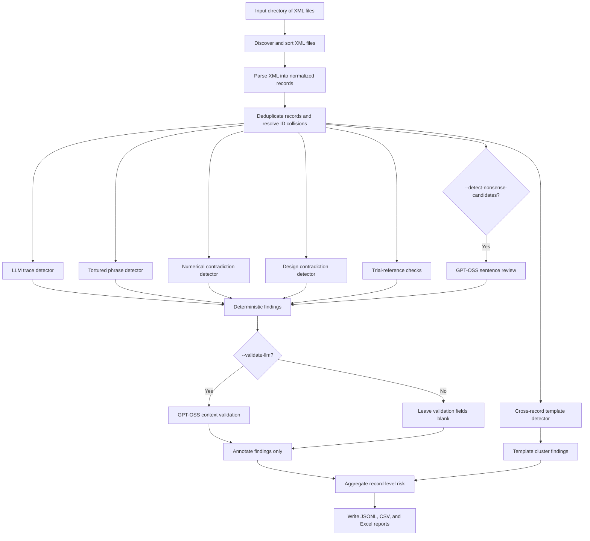

# ASCO Content Integrity Screening Pipeline

**Status:** Current implementation  
**Purpose:** Technical description of the batch workflow implemented in `asco_integrity`  
**Primary entry point:** `scripts/run_pipeline.py`

**Diagram set:** [`docs/PIPELINE_DIAGRAMS.md`](PIPELINE_DIAGRAMS.md)

## 1. Purpose and boundary

The pipeline screens a batch of Wiley/ASCO XML abstracts for four explainable content-integrity signals:

1. explicit LLM or chatbot response residue;
2. known tortured phrases from a supplied dictionary; and
3. repeated abstract templates within the current batch; and
4. optional low-severity nonsense candidates missed by the phrase dictionary.

It produces record-level data, detailed evidence, risk summaries, audit metadata, and one consolidated Excel workbook for editorial review. It is a triage system: a finding means **manual review is recommended**, not that misconduct, AI authorship, or a publication decision has been established.

AI-generated-text classification is intentionally outside the pipeline's scope.

## 2. End-to-end workflow



The default path is deterministic and local. Network access occurs only when `--validate-llm`, `--detect-nonsense-candidates`, or `--verify-trials` enables an external service.

## 3. Inputs and configuration

The command-line interface accepts:

| Argument | Default | Function |
|---|---|---|
| `--input-dir` | `WILEY_LIVE_PREFLIGHT_metadata_files` | Root directory searched recursively for `*.xml` files |
| `--tortured-dictionary` | `🤷_tortured.csv` | CSV containing tortured-phrase rules and expected terms |
| `--output-dir` | `outputs` | Destination for all generated artifacts |
| `--legacy-similarity-threshold` | `0.88` | Legacy-only threshold used with `--compare-legacy-template-clustering` |
| `--validate-llm` | disabled | Enables per-finding GPT-OSS context validation |
| `--detect-nonsense-candidates` | disabled | Enables sentence-level GPT-OSS review for dictionary misses |
| `--verify-trials` | disabled | Verifies valid NCT identifiers against ClinicalTrials.gov; local format and placeholder checks always run |

Run the default pipeline with:

```bash
python scripts/run_pipeline.py
```

An explicit run is:

```bash
python scripts/run_pipeline.py \
  --input-dir WILEY_LIVE_PREFLIGHT_metadata_files \
  --tortured-dictionary '🤷_tortured.csv' \
  --output-dir outputs \
  --compare-legacy-template-clustering \
  --legacy-similarity-threshold 0.88
```

The optional validator reads these settings from the environment or `.env`:

| Setting | Required | Meaning |
|---|---:|---|
| `INTELLIHUB_API_KEY` or `api_key` | yes | IntelliHub gateway credential |
| `INTELLIHUB_BASE_URL` | no | Gateway base URL |
| `INTELLIHUB_MODEL` | no | Gateway model name; defaults to `prod/gpt-oss-20b` |
| `INTELLIHUB_VERIFY_SSL` | no | SSL verification switch; defaults to `true` |
| `INTELLIHUB_CA_BUNDLE` | no | Optional CA bundle path |

## 4. Stage 1 — XML discovery and parsing

`discover_xml_files()` recursively locates XML files and sorts their paths for stable processing order.

The parser uses `lxml` with external entity resolution and network access disabled. It supports two primary Wiley shapes:

| Root | Behavior |
|---|---|
| `article` | Parses the root article and every nested `sub-article` as separate records |
| `article_set` | Parses the first nested article using Manuscript Central field variants |
| any other root | Preserves available raw text and emits an `unexpected_root` warning |

Malformed XML is converted into a failed `ParsedRecord`; it does not abort the batch. The failed record contains the source filename, a fallback ID, and an `xml_parse_failed` warning.

### 4.1 Normalized record

Each XML item becomes a `ParsedRecord` with:

- source file and schema type;
- record ID and DOI;
- title and normalized abstract text;
- abstract sections and a structured/unstructured flag;
- keywords, authors, and affiliations;
- journal, article type, and publication year;
- combined raw detector text and an audit list of excluded content blocks;
- parse status and warnings.

Namespace-independent XPath expressions and ordered fallbacks handle field-name differences between the supported XML shapes. The record ID falls back through manuscript/submission identifiers, abstract ID, DOI, and finally the filename stem.

### 4.2 Abstract normalization

The parser:

- extracts explicit `<sec>` elements when present;
- otherwise recognizes common structured headings such as Background, Methods, Results, and Conclusions;
- falls back to one `Abstract` section for unstructured text;
- normalizes whitespace; and
- excludes author, affiliation, reference, citation-block, and `table-wrap` content from detector text while recording the excluded categories.

Missing expected fields produce warnings and set the record status to `parsed_with_warnings`. The expected fields are record ID, title, abstract text, journal, article type, and publication year.

## 5. Stage 2 — Deduplication and record identity

Records are grouped by `record_id` before detection:

- an exact duplicate from the same source is kept once and logged as `ingestion_duplicate`;
- different records sharing an ID are retained, and later IDs are rewritten using the source filename stem plus a numeric suffix when necessary;
- every retained record is guaranteed to have a unique ID.

These actions are added to the parse-warning output so downstream joins remain traceable.

## 6. Stage 3 — Rule preparation

Two rule sets are prepared once per run.

### 6.1 LLM trace rules

The built-in dictionary contains explicit, auditable regular expressions grouped into categories such as:

- AI self-identification;
- knowledge or capability disclaimers;
- response preambles and closings;
- prompt leakage;
- interface residue; and
- weaker conversational or Markdown residue.

Each rule has a fixed ID, severity, and confidence.

### 6.2 Tortured-phrase rules

The supplied CSV provides:

- `Fingerprint - Tortured Phrase`;
- `Expected Text`; and
- `Nb Retrieved Papers`.

The loader interprets quoted phrases plus supported `AND`, `OR`, and `NOT` context clauses. It compiles sentence-safe, case-insensitive regular expressions and creates stable `TP-...` IDs from a hash of the source query and expected term. Rules are indexed by their first one or two tokens to avoid testing the entire dictionary against every abstract.

Empty rules, rules without usable tokens, and unqualified single-token rules are skipped.

## 7. Stage 4 — Per-record deterministic detection

Tortured-phrase detection inspects the backward-compatible normalized title and abstract text. LLM response-trace detection inspects preserved title and paragraph/preformatted blocks.

### 7.1 LLM response traces

Rules load from the shared versioned YAML catalogue. Every regex match retains its exact block, section, local source span, complete sentence or paragraph context, quotation context, and rule metadata before conversion to `Finding`. Quoted evidence is retained and requires validation.

`--detect-llm-semantic` additionally discovers source-verified semantic variants and novel occurrence candidates across every eligible record. This detector identifies explicit residue only. It does not infer that otherwise normal prose was written by AI.

### 7.2 Tortured phrases

The detector retrieves candidate rules from the token index, verifies all required context groups, rejects excluded context, and then records each actual phrase match. Findings also carry the dictionary's expected scientific term.

All findings receive stable run-local IDs (`FND-00001`, `FND-00002`, and so on) after sorting by record, detector, rule, field, and severity. Abstract matches retain their parsed section label for dashboard grouping.

### 7.3 Optional nonsense candidates

`--detect-nonsense-candidates` runs after Level A tortured-phrase matching. Sentences with a Level A match, fewer than eight tokens, heading-only/boilerplate text, or no gene-and-drug pattern co-occurrence are skipped locally. Each surviving sentence is reviewed by GPT-OSS using the same IntelliHub client and strict-JSON parsing as context validation.

Only a model response marking the sentence not understandable creates a `nonsense_candidate` finding. It quotes the suspected phrase, preserves the full sentence as evidence, records the explanation/model/prompt version, and always has low severity. The check is sentence-level and candidate-only; it does not classify the abstract or infer authorship. Invalid model responses create no candidate.

### 7.4 Contradiction and trial-reference checks

Numerical and study-design contradiction detectors run locally on every comparable record. Trial-reference format, placeholder, missing-ID, and unsupported-registry checks also run locally. `--verify-trials` additionally checks valid NCT identifiers against ClinicalTrials.gov using the persistent output-directory cache.

## 8. Stage 5 — Optional context validation

When `--validate-llm` is enabled, tortured phrases and only validation-eligible LLM traces are sent individually to GPT-OSS 20B through the IntelliHub chat-completions endpoint. The LLM response-trace validator receives exact source span, sentence, neighboring sentences, full paragraph, block, section, category, match type, rule ID, and quotation context. The generic validator receives:

- matched text;
- expected term, when applicable;
- evidence snippet;
- source field; and
- detector type.

The expected response is strict JSON with a status of `confirmed`, `rejected`, or `uncertain`, plus a one-sentence editorial reason. Requests use zero temperature, a 120-second timeout, and up to three attempts with exponential backoff. Unusable responses and exhausted request failures become `uncertain` rather than removing the original finding.

Validation never deletes audit findings or validates template clusters. Confirmed, rejected, and uncertain LLM statuses do affect only the LLM reviewer-priority contribution: rejected findings are excluded, uncertain semantic candidates remain Low, and supporting findings never contribute independently. Tortured-phrase behavior remains annotate-only. Without validation, ambiguous LLM findings remain pending while high-precision deterministic findings use `not_required`.

## 9. Stage 6 — Pair-first template detection

`exact_text_reuse` and `entity_normalized_template` independently produce pair evidence. Results for the same canonical pair are merged once, with ranked confidence and both detector signals retained. Exact numeric similarities remain separate.

Accepted high/very-high pairs, plus independently supported medium pairs, become graph edges. Connected groups are verified against a medoid. Two-member groups remain pair findings; only verified groups of three or more appear as template families.

The temporary legacy implementation runs only with `--compare-legacy-template-clustering`. Its threshold is `--legacy-similarity-threshold`, and its JSONL output never enters production findings, summaries, risk, counts, or workbook sheets.

## 10. Stage 7 — Risk aggregation

Risk is computed once per record from active rule findings, optional low-severity nonsense candidates, and one template concern regardless of how many pair signals or family memberships support it. LLM findings first collapse to one validation-aware reviewer-priority signal.

| Condition | Overall risk |
|---|---|
| No findings and no template pair | `None` |
| Signals from two or more detector types | `High` |
| Any high-severity finding | `High` |
| Any medium-severity finding | `Medium` |
| More than one low-severity finding | `Medium` |
| One low-severity finding | `Low` |
| Template pair only | Determined by pair severity |

Any risk other than `None` sets `review_required` to `Yes` with neutral language recommending manual review. The scoring does not make an acceptance, rejection, fraud, or authorship determination.

## 11. Stage 8 — Outputs

Every run creates these files in the configured output directory:

| File | Contents |
|---|---|
| `parsed_records.jsonl` | Full normalized record objects, including abstract sections and warnings |
| `parsed_records.csv` | Flat record export for analysis |
| `integrity_findings.csv` | Compact reviewer queue with evidence, severity, confidence, and review status |
| `detailed_findings.csv` | Full diagnostic fields for rule findings and consolidated template pairs |
| `numerical_contradictions.csv` | Native detailed numerical-contradiction findings |
| `design_contradictions.csv` | Native detailed study-design contradiction findings |
| `trial_verification.csv` | All discovered trial references and their verification outcomes |
| `template_pair_findings.csv` | Stable detailed pair-evidence schema, including source metadata and separate similarity metrics |
| `template_clusters.csv` | One row per verified visible family of three or more members |
| `pattern_dictionary.csv` | Effective LLM and tortured-phrase rules used by the run |
| `parse_warnings.csv` | Parser warnings and record-ID deduplication actions |
| `run_metadata.jsonl` | Input/output paths, counts, thresholds, dictionary version, and scope notes |
| `content_integrity_screening_poc.xlsx` | Consolidated editorial workbook |

The workbook contains nine sheets:

1. **Dashboard** — review priority, check, cluster, warning, and section counts;
2. **Data Inventory** — parse totals, XML roots, and field coverage;
3. **Abstract Summary** — one row per retained record with flags, counts, risk, and review status;
4. **Integrity Findings** — one row per rule or template finding with exact evidence;
5. **Template Pairs** — detailed pair evidence using the same ordered schema as the pair CSV;
6. **Template Clusters** — verified family summaries;
7. **Pattern Dictionary** — rules used for the run;
8. **Parse Warnings** — ingestion and data-quality issues; and
9. **Run Metadata** — configuration and audit context.

Renamed fields: `similarity_score` is not used for new families; use `family_confidence`, `edge_density`, and `median_pair_confidence`. `template_cluster_similarity_score` is removed from the abstract summary. `template_cluster_flag` now means visible family membership only; `template_flag` means at least one accepted pair.

The Python-only `run_default_pipeline(similarity_threshold=...)` argument is retained temporarily as a deprecated alias for `legacy_similarity_threshold`; it never changes production pair detection.

The summary includes every retained record, including records with no findings.

## 12. Failure handling and operational behavior

- One malformed XML file does not stop the batch.
- Missing metadata is reported rather than silently discarded.
- Duplicate IDs are resolved before detectors and reports create joins.
- Validator response or request failures are recorded as `uncertain` per finding.
- Nonsense-review failures create no candidate finding; the feature is opt-in and candidate-only.
- Enabling validation without an API key stops at validator initialization with a configuration error.
- Output files are rewritten in the selected output directory on each run.
- Detection and validation are currently sequential; no queue, database, or persistent reference corpus is involved.

## 13. Auditability and reproducibility

The pipeline preserves:

- source filename and record ID on records and findings;
- exact matched text and surrounding evidence;
- detector, category, rule ID, severity, and confidence;
- the effective rule dictionary;
- template component scores and peer records;
- validator model and prompt version when enabled; and
- run timestamp, paths, counts, threshold, dictionary version, and scope statement.

Deterministic results are reproducible for the same code, inputs, dictionary, and configuration. Finding and cluster IDs are stable only within the ordering and contents of a run; they are not persistent database identifiers.

## 14. Current limitations

- Level A recall is limited to the supplied dictionary; Level B considers only sentences passing its narrow gene/drug co-occurrence gate.
- The LLM detector recognizes explicit residue patterns, not general AI authorship.
- Template weights and thresholds are transparent heuristics; the synthetic sweep does not replace calibration on labelled ASCO data.
- Validator output can vary because it is model-generated; rejected LLM candidates remain auditable but are removed from active LLM priority.
- Records from unexpected XML roots retain raw text but do not receive full schema-specific metadata extraction.

## 15. Verification

The test suite covers supported XML shapes, bundled sub-articles, excluded author/reference content, record deduplication, tortured-query semantics, LLM residue, nonsense candidates, template matching, dashboard reconciliation, risk-report integration, workbook creation, and validator response handling.

Run it with:

```bash
python -m unittest discover -s tests -v
```

## 16. Module map

| Module | Responsibility |
|---|---|
| `asco_integrity/pipeline.py` | Orchestration, aggregation, CLI configuration, and output assembly |
| `asco_integrity/xml_parser.py` | XML discovery, backward-compatible normalized extraction, lossless trace blocks, warnings |
| `asco_integrity/detectors/llm_trace.py` | Deterministic response-residue matching from the shared YAML catalogue |
| `asco_integrity/detectors/llm_trace_semantic.py` | Opt-in semantic variants, novel candidates, batching, and exact evidence verification |
| `asco_integrity/detectors/llm_trace_fusion.py` | Deterministic–semantic deduplication and LLM priority |
| `asco_integrity/detectors/tortured_phrase.py` | Dictionary loading, query interpretation, indexing, and matching |
| `asco_integrity/detectors/nonsense_candidate.py` | Opt-in sentence prefiltering and GPT-OSS candidate annotation |
| `asco_integrity/template_detection.py` | Masking, candidate generation, similarity, and clustering |
| `asco_integrity/validators/context_validator.py` | Optional IntelliHub/GPT-OSS finding validation |
| `asco_integrity/validators/llm_trace_validator.py` | Selective response-residue validation with source context |
| `asco_integrity/aggregation/risk_engine.py` | Record-level risk rules |
| `asco_integrity/reporting.py` | JSONL, CSV, and Excel generation |
| `asco_integrity/models.py` | Records, findings, validation results, and cluster-member data models |
| `asco_integrity/utils.py` | Shared normalization, formatting, and deduplication helpers |
